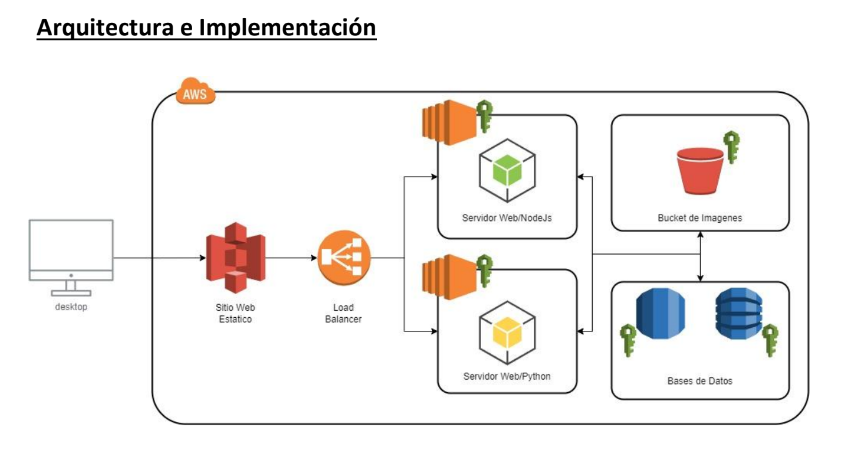
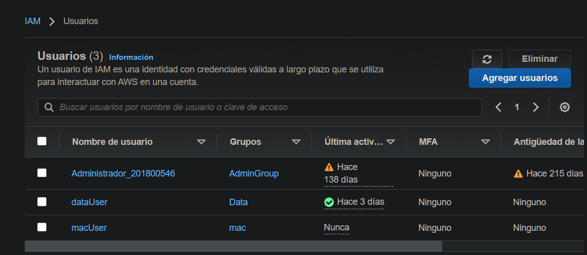
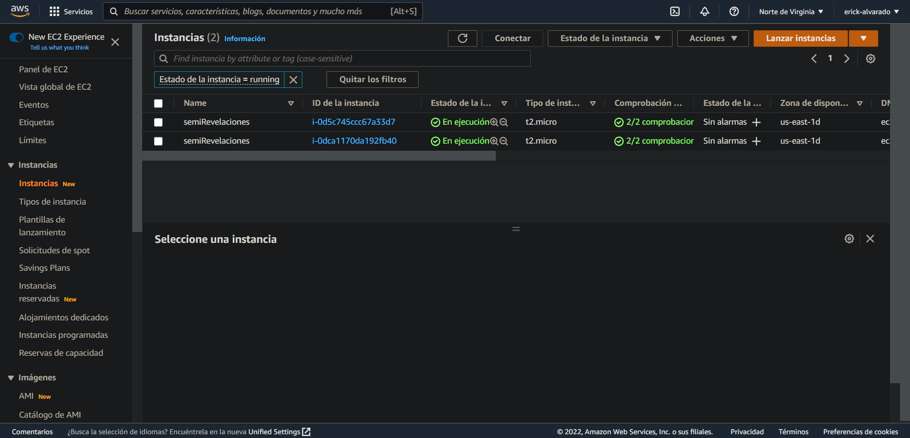
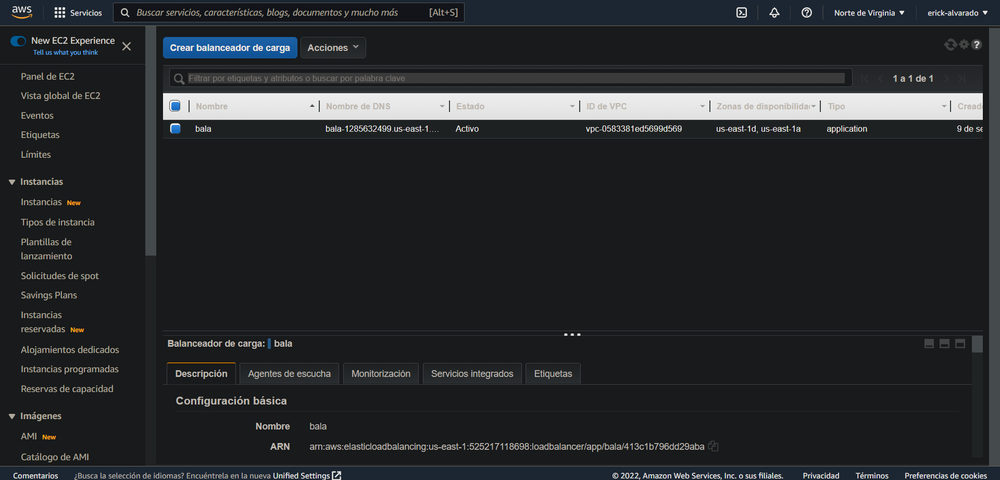
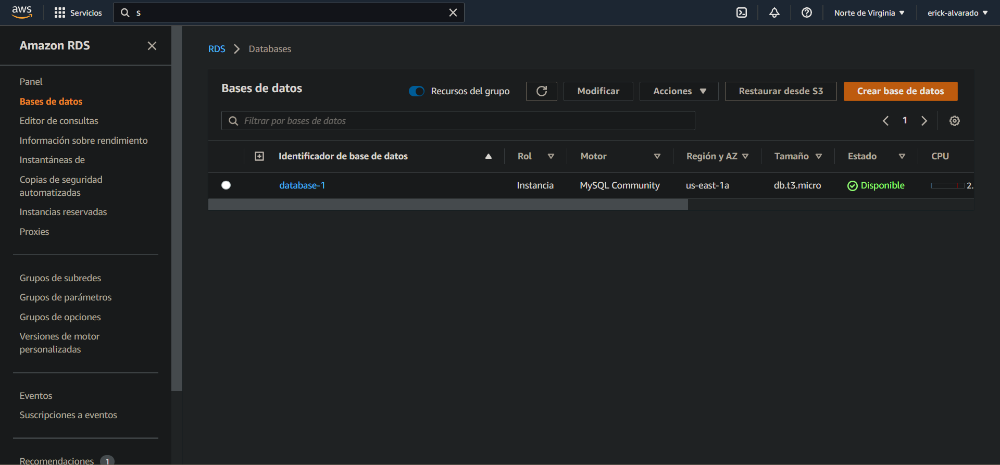

# SEMINARIO DE SISTEMAS 1

## Proyecto 1 

### Datos Estudiantes
| Nombre | Carné |
| ------ | ------ |
| Ricardo Antonio Dubon Contreras  | 201612131 |
| Brandon Mauricio Noj Romero  | 201801028 |
| Osmar Abdel Peña Santizo  | 201801619 |
| Erick Alexander Alvarado Guerra  | 201800546|

# MANUAL TECNICO
## OBJETIVOS
- Definir, implementar y desarrollar una solucion optima para el problema planteado haciendo uso de herramientas en la nube.
- Conocer mas a detalle las herramientas proporcionadas por el proveedor de servicios de computacion en la nube publica Amazon Web Services (AWS) y utilizar sus servicios como plataforma para desarrollar la solucion antes mencionada.
- Crear un entorno de trabajo en equipo, poner en practica la resolucion de problemas individuales y colectivos, llevar a cabo una aplicacion con un grupo de desarrolladores.

## ARQUITECTURA DEL PROYECTO 

Toda la arquitectura del software realizado fue colocada en la nube para su facil acceso y alta disponibilidad, esto debido a que fue colocada utilizando los servicios de AWS, empresa la cual es la numero 1 con respecto a cloud computing, esto segun un estudio realizado por Garntner.

### Sitio web estatico
El sitio web estatico fue realizado utilizando la herramienta React y alojado en S3 para que pueda ser accedido mediante una URL por cualquier dispositivo con acceso a internet.

### Load balancer
El balanceador de carga es una herramienta que distribuye las peticiones a los dos servidores que se han implementado, esto con el objetivo de tener una mayor disponibilidad y un balance en cuanto a procesamiento, esto ultimo dividido entre los dos servidores. El balanceador de carga es accedido mediante una URL del lado del frontend(sitio web estatico).

### Servidor web NodeJS/Python
Se crearon dos servidores utilizando diferentes herramientas pero con endpoints y respuestas identicas, esto con el objetivo que puedan ser combinados como uno solo por medio del load balancer, estos a su vez se conectan con un bucket en S3 para alojar archivos y con una base de datos MySQL alojada en el servicio RDS de AWS. Estos dos servidores estan alojados en instancias separadas de EC2.

### Bucket de Imagenes
El bucket de imagenes es un bucket de S3 en AWS, el cual es un servicio de alojamiento de archivos, no solamente imagenes, el cual fue utilizado para subir todos los archivos que los usuarios quisieran. Al momento de subir un archivo al bucket en S3 desde el frontend se realiza la elaboracion de una URL en el backend con la cual se puede acceder al archivo alojado en la nube, esta URL se guarda en la base de datos.

### Base de datos
Para la base de datos se creo una instancia de MySQL desde RDS el cual es un servicio de AWS que proporciona bases de datos relacionales en la nube.

## DESCRIPCION USUARIOS IAM
Se crearon multiples tipos de usuario con acceso restringido a las distintas caracteristicas de aws. 

- Administrador: posee todos los permisos sobre la cuenta de aws
- dataUser: contiene permisos a bucket y base de datos
- macUser: posee permisos a servicios de EC2 para el manejo de maquinas virtuales.

## CONFIGURACION DE CADA SERVICIO
- EC2

    

- LoadBalancer

    

- RDS

    

## CONCLUSIONES 
- Se desarrollo una aplicacion cumpliendo los requerimientos solicitados, todo esto utilizando tecnologias alojadas en la nube. La aplicacion puede ser accedida mediante una URL desde cualquier dispositivo en el mundo con acceso a internet.
- Se utilizaron los servicios de EC2, S3, RDS, Load Balancer e IAM de AWS para poder llevar acabo el desarrollo de la aplicacion.
- Se logro el correcto funcionamiento del equipo de trabajo establecido, cumpliendo cada uno con las tareas asignadas y apoyandonos cuando habia algun reto en algunas de las tareas asignadas.