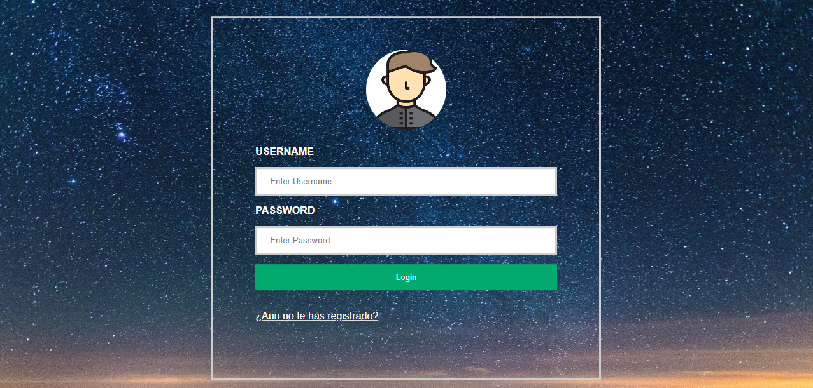
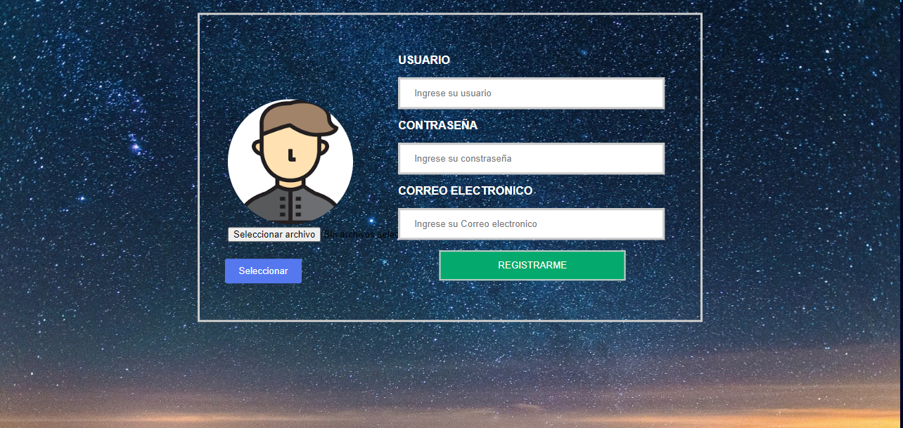
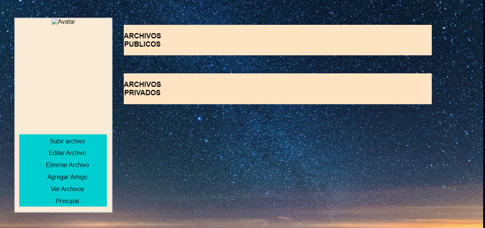
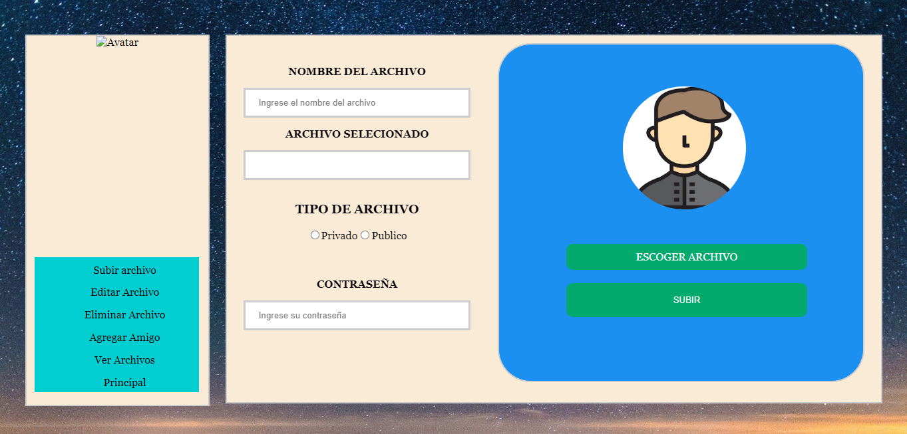
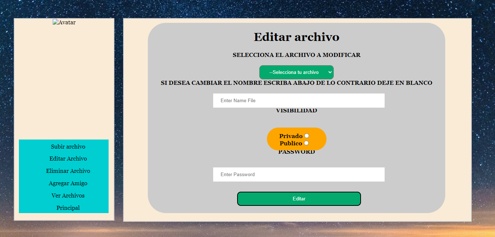
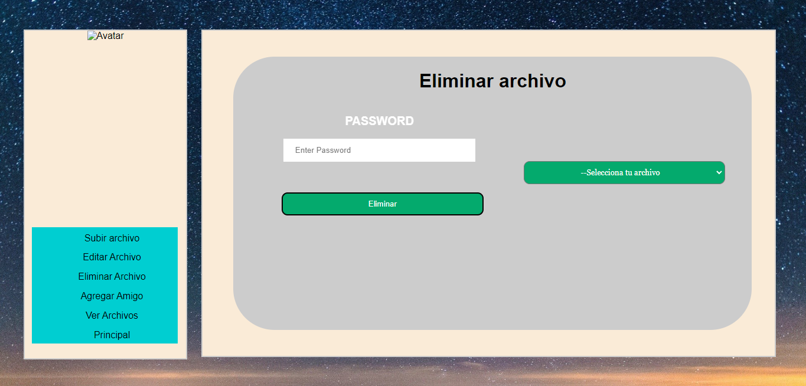
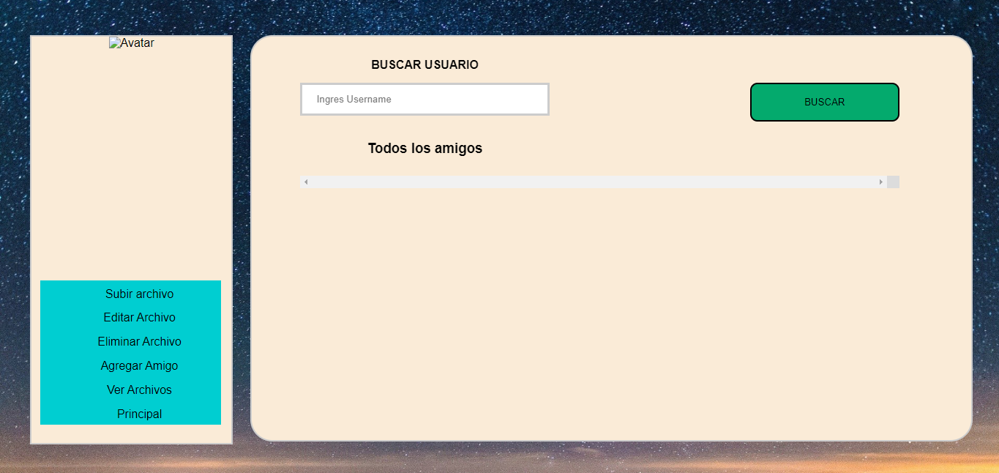
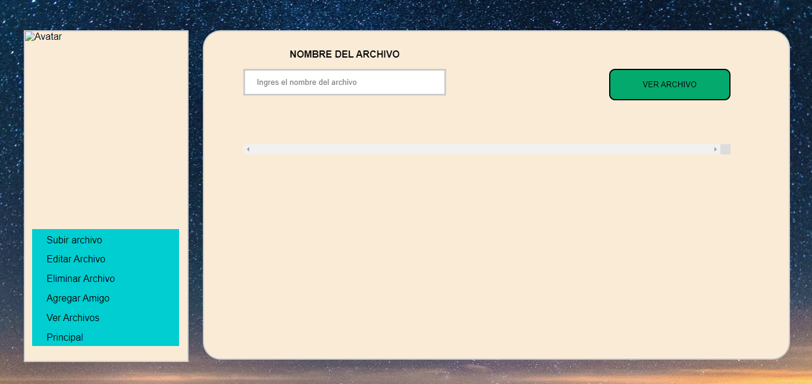

**<h1 align="center"> MANUAL DE USUARIO.</h1>**

----
**<h4 align="center"> OBJETIVOS</h4>**
- Facilitar la tarea de conocimiento, uso y aprendizaje del sistema desarrollado.
- Dar a conocer todas las funciones y operaciones que este sistema ofrece, al mismo tiempo que se detalla cada una de las anteriormente mencionadas.
- Mostrar mediante imagenes el flujo que el usuario debería tener dentro de la aplicación para dar el correcto uso a la misma.

----
**<h3 align="center"> EXPLICACION DE LA APLICACION.</h3>**
Super-Storage es una aplicacion que nos permite crear un perfil y subir archivos pdf, txt o imagenes que queramos guardar en la nube. Tendremos la opción de escoger si queremos que sea privado (solo nosotros podremos ver esos archivos) o publicos (cualquier persona que nos agregue podrá ver nuestros archivos.). Al subir archivos podremos hacer distintas acciones con ellos, como eliminar el archivo,editar el archivo (Cambiar de nombre o visibilidad de publico a privado o viceversa). 

Tendrá una opción para agregar amigos, en la cual al agregarlos tendremos la posibilidad de ver los archivos publicos de ellos.

----
**<h4 align="center"> PANTALLA DE LOGIN.</h4>**

 En la primera imagen podemos ingresar con un usuario ya registrado dentro de la pagina web o bien se puede registrar en el link "Aun no te ha registrado?

Fuente: Elaboración propia 2022.

----
**<h4 align="center"> PANTALLA DE REGISTRO.</h4>**

 En la segunda imagen podemos registrarnos en la aplicacion, donde nos pediran el usuario, una contraseña la cual tenemos que repetir para verificar que si esta correcta, un correo electronico y de ultimo una imagen para nuestro perfil en nuestra aplicación.

Fuente: Elaboración propia 2022.

----
**<h4 align="center"> PANTALLA PRINCIPAL.</h4>**

 En la tercera pantalla podemos observar al momento de ingresar con nuestras credenciales correctamente, la pantalla principal de aplicación en donde podemos ver nuestros archivos publicos y privados los cuales hemos subido o subiremos dentro del apartado que dice "subir archivo", así como también podemos ver En ese mismo apartado que se encuentran las opciones que podemos realizar dentro de nuestra aplicación.

Fuente: Elaboración propia 2022.

----
**<h4 align="center"> PANTALLA SUBIR ARCHIVOS.</h4>**

 
Acá podemos subir un archivo ya sea de tipo .txt .pdf o alguna imagen .jpg o png, en el apartado hay que llenar los campos del nombre del archivo con el cual lo podremos visualizar dentro de la aplicación así como el nombre con el que mis contactos pueden visualizarlo, lo cual unicamente lo podran hacer si nuestra visibilidad de nuestro archivo esta en publica, de lo contrario solo yo puedo ver ese archivo si lo subo como un archivo privado. Por ultimo para verificar nuestra identidad nos pedira nuestra constraseña para poder confirmar nuestro archivo y despues nos mandara un mensaje de archivo subido con exito.

Fuente: Elaboración propia 2022.

----
**<h4 align="center"> PANTALLA EDITAR ARCHIVO.</h4>**

 
En esta pantalla podremos cambiar el nombre de nuestro archivo así como también su visibilidad, todos estos archivos ya tienen que estar previamente subidos a nuestra aplicación. Y como siempre se le pedira la constraseña para confirmar su identidad.

Fuente: Elaboración propia 2022.

**<h4 align="center"> PANTALLA ELIMINAR ARCHIVO.</h4>**

 
En esta pantalla podremos eliminar un archivo que hayamos subido con aterioridad, y unicamente le pedira que ingrese su contraseña para verificar su identidad.

Fuente: Elaboración propia 2022.

**<h4 align="center"> PANTALLA AGREGAR AMIGO.</h4>**

 
En esta pantalla podemos agregar a alguna persona que se encuentre registrada dentro de nuestra aplicación lo cual unicamente tendremos que darle en el botón de agregar y automaticamente se agregara a nuestra lista de amigos.

Fuente: Elaboración propia 2022.

**<h4 align="center"> PANTALLA VER ARCHIVOS.</h4>**

 
En esta pnatalla podemos ver los archivos publicos de los amigos que previamente hemos agregado, tomando encuenta que unicamente podemos ver los archivos publicos.

Fuente: Elaboración propia 2022.
